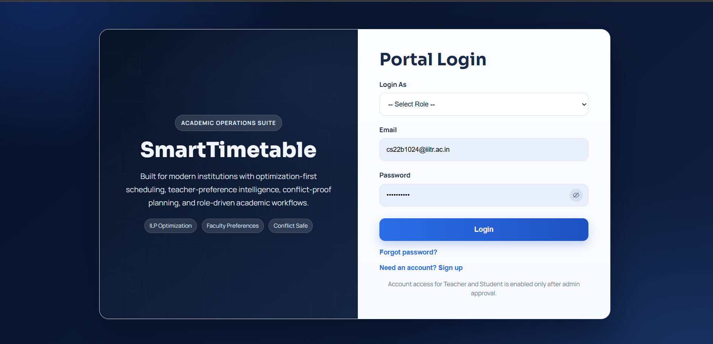

# SmartTimetable ERP

SmartTimetable ERP is a role-based college timetable management system with:
- Admin approval workflows
- Teacher preference submission
- Optimization-based timetable generation
- Student/Teacher personalized timetable views
- Academic calendar and event management

## UI Preview

### Login Page


## Tech Stack
- Python 3.11+
- Flask
- PuLP (ILP optimization)
- HTML/CSS/JavaScript (Jinja templates)
- File-based storage (text/JSON lines)

## Roles and Key Features

### Admin
- Approve/reject teacher and student signup requests
- Approve/reject/edit teacher preference requests
- See `Generation Stack` of approved course preferences
- Generate timetable semester-wise
- Edit/delete timetable rows before generation
- View semester-wise timetable generation history
- Manage events and vacations

### Teacher
- Signup/login after admin approval
- Submit subject preferences (day/slot/target department)
- View pending/approved preference status
- View personal timetable
- Manage own calendar events

### Student
- Signup/login after admin approval
- View department-based personal timetable
- View institute timetable with filters
- View academic calendar and event details

## Mathematical Timetable Generation (Brief)
The timetable is generated using Binary Integer Linear Programming:
- Decision variable: `x[c,s,r]` (course-slot-room assignment, 0/1)
- Hard constraints:
  - Required classes per course
  - Teacher clash prevention
  - Room clash prevention
  - Room capacity constraints
- Objective:
  - Minimize preference violations
  - Minimize late-slot usage
  - Apply teacher-priority cost

Implementation file: `timetable.py`

## Project Structure

```text
SmartTimetable/
├── app.py                         # Main Flask app (routes + workflows)
├── timetable.py                   # ILP model and timetable generation
├── templates/                     # All UI templates
│   ├── login.html
│   ├── admin.html
│   ├── admin_edit_preference.html
│   ├── admin_edit_event.html
│   ├── admin_edit_timetable.html
│   ├── teacher_dashboard.html
│   ├── student_dashboard.html
│   ├── student_timetable.html
│   └── profile.html
├── static/
│   └── profile_pics/              # Uploaded profile pictures
├── users.txt                      # Approved users
├── users_pending.txt              # Pending signup requests
├── approval_history.txt           # Signup approve/reject history
├── preference_requests.txt        # Pending teacher preferences
├── preference_history.txt         # Preference decision history
├── data.txt                       # Approved course preferences (generation source)
├── timetable_output.txt           # Current generated timetable
├── timetable_history.txt          # Semester-wise generation history
├── events.txt                     # Calendar events
└── README.md
```

## How to Start the Project

### 1. Open terminal in project folder
```bash
cd /d c:\Users\LENOVO\Desktop\MiniProject2\Code\SmartTimetable
```

### 2. Install dependencies (first time only)
```bash
pip install flask pulp
```

### 3. Run the server
```bash
python app.py
```

### 4. Open browser
```text
http://127.0.0.1:5000/login
```

If port `5000` is busy:
```bash
set PORT=5050
python app.py
```
Then open:
```text
http://127.0.0.1:5050/login
```

## Recommended Demo Flow
1. Login as admin
2. Approve pending teacher/student accounts
3. Approve teacher preference requests
4. Open `Generate Timetable` section
5. Review `Generation Stack`
6. Generate timetable
7. Verify timetable in admin, teacher, and student dashboards

## Google Login Setup (Teacher/Student)

Google login is available on the login page for `Teacher` and `Student` roles.
It authenticates with Google, then allows access only if the same email+role is already approved in `users.txt`.

### 1. Create OAuth credentials in Google Cloud
- Create an OAuth 2.0 Web Application credential.
- Add Authorized Redirect URI:
  - `http://127.0.0.1:5000/auth/google/callback`

### 2. Set environment variables before running
```bash
set GOOGLE_CLIENT_ID=your_google_client_id
set GOOGLE_CLIENT_SECRET=your_google_client_secret
set GOOGLE_REDIRECT_URI=http://127.0.0.1:5000/auth/google/callback
```

Optional (restrict sign-in to one domain):
```bash
set GOOGLE_ALLOWED_DOMAIN=iiitr.ac.in
```

### 3. Run server
```bash
python app.py
```

## Notes
- This project uses file-based persistence for academic/demo simplicity.
- Deleting/editing rows in generate snapshot also syncs source preferences for future generation consistency.

